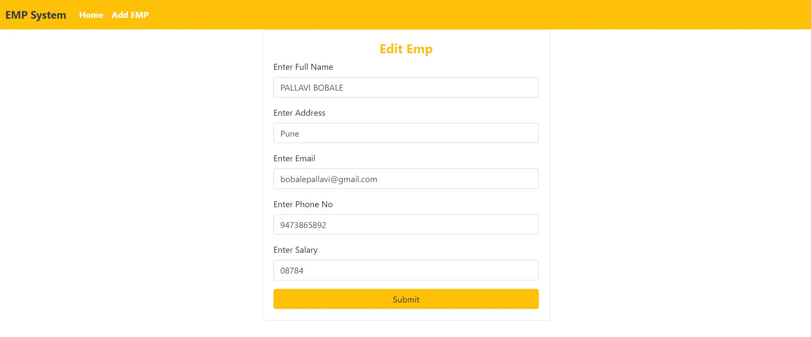

# -Employee-Management-System

This project is used for computerizing employee management work in offices, schools, etc. The software keeps record of employee's email, phone no,  and salary etc. The software is capable of easy storage of information related to employee through database.  

Create RESTfull API using any of the bellow technology

*** API Link (http://localhost:8083)***

Java 8 with Spring Boot Or Node and ExpressJs

I have created a simple employee management system web application using Spring Boot, Spring MVC, Thymeleaf, Spring Data JPA and MySQL database.
_______________________________________________________________________________________________________________________________________________________________________

# Technology used

   * Spring Boot
   
   * Spring MVC
   
   * Thymeleaf
   
   * Spring Data JPA
   
   * MySQL database.
   
   ___________________________________________________________________________________________________________________________________________________

# Employee Data

Employee data refers to all information collected by your company about its employees. It includes but is not limited to: basic identifying information (your employees name, phone no, address, salary) as well as in-depth information about workplace performance.

_____________________________________________________________________________________________________________________________________________________

# Add Data

Add Employee Data

______________________________________________________________________________________________________________________________________________________

# Update Data 

Update And Delete Employee Data 

_______________________________________________________________________________________________________________________________________________________

# Conclusion

Software for employee management systems helps your organization improve workforce productivity and boost overall well-being by tracking and monitoring the daily working activities of every employee
 ______________________________________________________________________________________________________________________________________________________
 
# Feedback

Valuable feedback will be appreciated. You can reach out to me vie below mediaum

______________________________________________________________________________________________________________________________________________________

# Contributor

Pallavi Bobale

